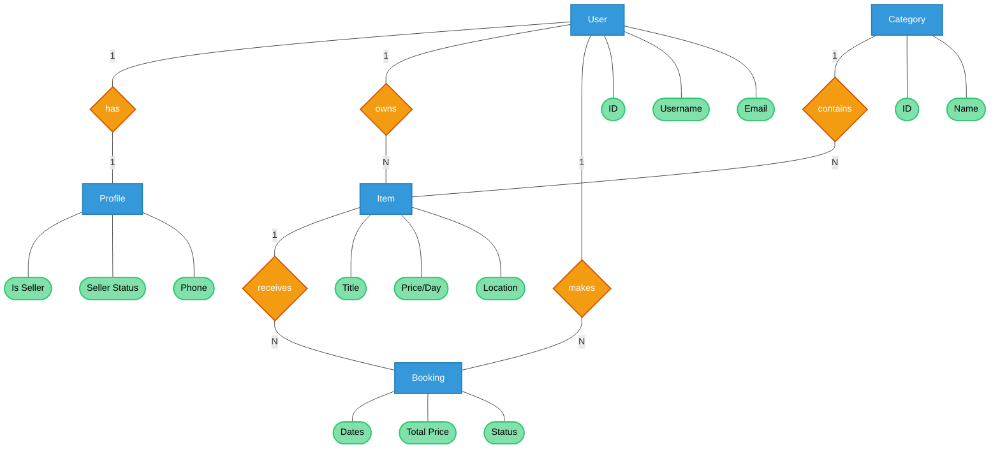
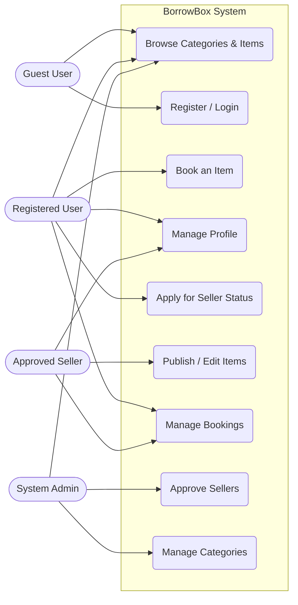
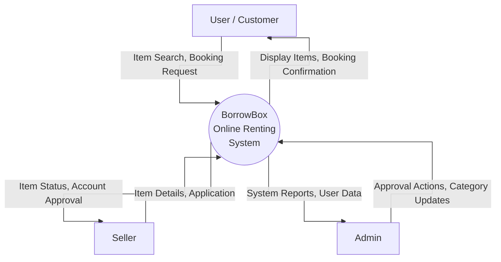
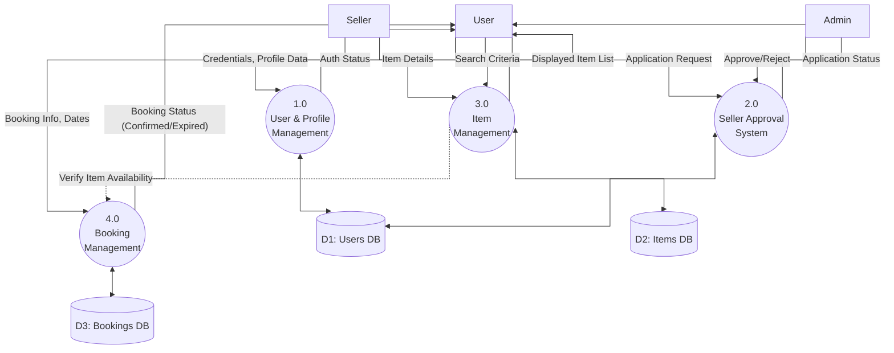

# BorrowBox (Online Renting System) - Software Diagrams

This document contains simple, professional, and editable diagrams based on your Django models and project architecture. 

### How to use and edit these diagrams:
1. **Markdown Viewers:** If you are using VS Code or GitHub, these will automatically render as diagrams.
2. **draw.io / diagrams.net:** Open [draw.io](https://app.diagrams.net/), click **Arrange** > **Insert** > **Advanced** > **Mermaid...** and paste the code block text inside.
3. **Mermaid Live Editor:** Copy the code block starting with `erDiagram` or `flowchart` and paste it into [Mermaid Live Editor](https://mermaid.live/) to view, tweak, and export as PNG or SVG.

---

## 1. Entity-Relationship (ER) Diagram (Chen's Notation)
This outlines the core entities, their attributes, and relationships mapping exactly to the visual style you requested.

---

## 2. Use Case Diagram
This maps out what different users (actors) can accomplish inside the system. 

---

## 3. Data Flow Diagram (DFD)

### Level 0 DFD (Context Diagram)
This shows the system as a single process interacting with external entities.

### Level 1 DFD
This breaks down the system into the main sub-processes.

